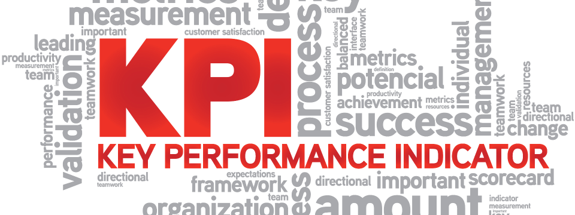

<!--
  * browser: key-performance-indicator
  * tracker: f44c30d1b876f8987cf78c727e573542
  * version: 5.0.0
  * updated: 2018-02-24T03:07:25Z
  * contact: Joel Parker Henderson (http://joelparkerhenderson.com)
  * options: commentable
-->

# Key Performance Indicator (KPI)

Contents:

* [What is a KPI?](#what-is-a-kpi)
* [How to define a KPI](#how-to-define-a-kpi)
* [How to improve a KPI](#how-to-improve-a-kpi)
* [Indicators](#indicators)
* [Key Leading Indicator (KLI)](#key-leading-indicator-kli)
* [Key Performance Measure (KPM)](#key-performance-measure-kpm)
* [Measure vs. metric](#measure-vs-metric)
* [Credits and links](#credits-and-links)

<subcontents>

KPI examples:

* [Finance](examples/finance.md)
* [Business process](examples/business_process.md)
* [Ecommerce](examples/ecommerce.md)
* [Efficiency](examples/efficiency.md)
* [Compliance](examples/compliance.md)
* [Service level agreements (SLAs)](examples/service_level_agreements.md)
* [Service quality](examples/service_quality.md)
* [Programmers](examples/programmers.md)
* [DevOps](examples/devops.md)
* [Kanban](examples/kanban.md)

</subcontents>

## What is a KPI?

A key performance indicator (KPI) is a type of performance measurement.

* A KPI evaluates the success of an organization or activity.

* Choosing the right KPIs needs good understanding of what is important to the organization.

Success examples:

* Repeated periodic achievement of an operational goal, such as 100% customer satistfaction, or zero defects, etc.

* Making progress toward strategic goals.

Wikipedia pages:

* [Performance indicator](https://en.wikipedia.org/wiki/Performance_indicator)

* [Performance measurement](https://en.wikipedia.org/wiki/Performance_measurement)

Our related guides that use KPIs:

* [Strategic balanced scorecard](https://github.com/joelparkerhenderson/strategic_balanced_scorecard)

* [System quality attributes](https://github.com/joelparkerhenderson/system_quality_attributes)

## How to define a KPI

To define a KPI, you can cover these areas:

* Title: use an exact name to avoid ambiguity

* Objective: the relation of the indicator with the organizational objectives must be clear

* Scope: state the areas of business and/or parts of the organization that are included and/or excluded.

* Target: Benchmarks must be determined in order to monitor progress

* Formula: the exact calculation of the indicator

* Units: what is/are the unit(s) of measurement in use

* Frequency: when is the indicator recorded and reported

* Data source: the exact data sources involved in calculating a indicator value

* Owner: the accountable person for the indicator

* Comments: any outstanding issues regarding the indicator

## How to improve a KPI

To improve a KPI, you can ask these questions:

* Does it clearly define what constitutes success?

* Does it clearly relate to a strategic objective and key result (OKR)?

* Does it provide the information required to set SMART goals?

* Does it accurately portray progress and probability of achieving both long-term strategic objectives and near-term milestones?

* Does it identify the root causes of barriers?

* Does it focus the organization on the priority improvement needs?

* Does it drive the behavior and actions required to achieve the objectives?

* Does it align work with value?

## Indicators

* Quantitative indicators: can be presented with a number.

* Qualitative indicators: can't be presented as a number.

* Leading indicators: predict the outcome of a process

* Lagging indicators: present the success or failure post hoc

* Input indicators: measure the amount of resources consumed during the generation of the outcome

* Process indicators: represent the efficiency or the productivity of the process

* Output indicators: reflect the outcome or results of the process activities

* Practical indicators: interface with existing company processes.

* Directional indicators: specifying how something is changing, such as getting better or worse.

* Actionable indicators: sufficiently in an organization's control to effect change.

* Financial indicators: used in performance measurement and when looking at an operating index.

## Key Leading Indicator (KLI)

A Key Leading Indicator (KLI) is a KPI that tends to show up earliest.

## Key Performance Measure (KPM)

A Key Performance Measure (KPM) is how you measure a KPI.

## Measure vs. metric

There is overlap between a measure and a metric.

* A measure is concrete, usually measure one thing, and are quantitative in nature (e.g. I have five apples).

* A metric describe a quality and require a measurement baseline (I have five more apples than I did yesterday).

Examples:

* A measure can be useful for demonstrating workloads and activity

* A metric can be useful for evaluating compliance, processes effectiveness, and measuring success against established objectives.

## Credits and links

* [PNMsoft KPI Examples](http://www.pnmsoft.com/resources/bpm-tutorial/key-performance-indicators/)

* [Metrics and Performance Measurement System for the Lean Enterprise](https://ocw.mit.edu/courses/aeronautics-and-astronautics/16-852j-integrating-the-lean-enterprise-fall-2005/lecture-notes/12_metrics.pdf)

* [Speed, Accuracy, Quality, and Joy: Four areas every product manager should focus on to increase their team intelligence](https://productcoalition.com/four-areas-every-product-manager-should-focus-on-to-increase-team-intelligence-829bb9e269e2)

* [Quora: What are good KPIs for programmers](https://www.quora.com/What-are-good-KPIs-for-programmers)
